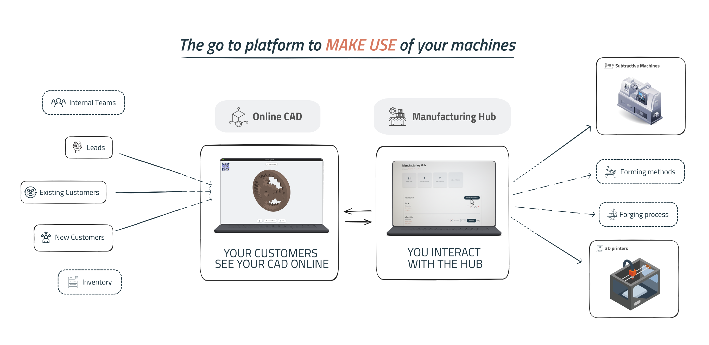

# Gates 
 
Rethinking digital manufacturing. The applicative to understand if you can produce the device you are thinking out... price and physics-wise.

<div align="center">
  
</div>

**Gates** provides a **Manufacturing Hub** that connects customers and manufacturers through an split online platform.  
It combines a **a privately owned online CAD**, **instant quoting**, and **feasibility analysis** to streamline the entire production process — from design to delivery.

## Overview

It offers manufacturers a centralized digital hub to manage and attract clients, while empowering customers to design and price products in real time in the CAD front end.

### For Manufacturers

- Gain visibility and reach new customers.
- Manage and track existing clients efficiently.
- Avoid uncertain prospects with automated feasibility checks.
- Streamline interactions with a transparent, automated quoting process.

### For Manufacturers' Consumers

- Design devices directly in the **Online CAD** environment.
- Get **instant quotes**, **feasibility checks**, and **design optimizations** before submitting an order.
- Issue orders directly to the most suitable manufacturing partner.

## Who It’s For

**Gates** serves a wide range of production environments:
- Large manufacturing lines (e.g. **plastic injection** facilities).
- Small workshops and independent makers with a single **3D printer**.

It is especially beneficial for companies with **well-established production methods** who struggle to fully utilize their machinery due to **manual or inefficient order handling**.

## Building and Deploying

You can build and deploy the landing page for development, staging, or production using the following commands:

### Build Environments

Configure your environment variables inside the appropriate `.env.[mode].local` files prior to building.

```shell
# Local/Development Build (Reads .env.development.local)
npm run build-local

# Staging Build (Reads .env.staging.local)
npm run build-staging

# Production Build (Reads .env.production.local)
npm run build-production
```

An example of ```.env.development.local```

``` shell
VITE_DEMO_URL=http://demo.localhost
VITE_APP_URL=http://app.localhost/login
VITE_PARTNER_APP_URL=http://app.localhost/referral-login
VITE_API_URL=http://app.localhost/api
```

### Deployment

Deployments utilize the configured targets inside the `Makefile` and automate file transfer via `rsync`.

```shell
# Deploy to Local test server
npm run deploy-local

# Deploy to Staging environment (includes pre-deploy remote backup)
npm run deploy-staging

# Deploy to Production environment (requires confirmation, includes backup)
npm run deploy-production
```

